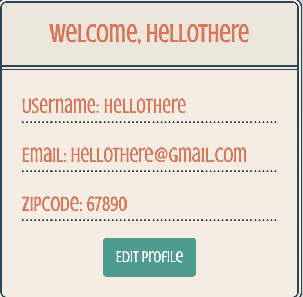

# Parent-Helper-Hub

Project #3

## Project Description

This app allows single parents access resources that they need in one app.

## Table of Contents

* [User Story](#user-story)
* [Acceptance Criteria](#acceptance-criteria)
* [Motivation for Development](#motivation-for-development)
* [Process](#process)
* [Technologies Used](#technologies-used)
* [Challenges](#challenges)
* [Successes](#successes)
* [Usage](#usage)
* [Goals for Future Development](#goals-for-future-development)
* [Support](#support)
* [Deployed Site](#deployed-site)
* [Tasks and Roles](#tasks-and-roles)
* [Credits and Contributors](#credits-and-contributors)

## User-Story

* AS A who is interested in helping single parents easily find resources for schools, housing, legal, and healthcare
* I WANT a place where all information is brought together into one site
* SO THAT it can support single parents
* AND SO THAT these resources are easily accessible

## Acceptance Criteria

* GIVEN a Parent Helper Hub Site

* WHEN I visit the site for the first time
* THEN I am presented on a homepage, landing site, which includes information about the site, signup, and contact us info
* WHEN I click on login/sign up
* THEN I am prompted to sign up or login in
* WHEN I sign up
* THEN I must provide a valid email address, username, zipcode, number of children, and a password
* WHEN I am done signing up
* THEN I am automatically directed to the home page
* WHEN I already have an account
* THEN I can login using an email and password
* WHEN I am done logging in
* THEN I am automatically directed to the home page
* WHEN I am logged in
* THEN I can select an icon in the top navbar
* WHEN I would like to search for Schools, Housing, Healthcare, Legal I select one
* THEN I am redirected to a search page for the chosen topic
* WHEN I want to save a search item
* THEN I select save on the search item
* WHEN I select Profile from the navbar
* THEN I am redirected to the profile page where my username appears on the top welcoming me
* WHEN I want to update profile information
* THEN I select the edit/update button to modify some of the profile information
* WHEN I select Logout
* THEN I am logged out of the site

## Motivation for Development

It came to our attention that single parents struggles finding resources in one easily accessible location.
The purpose of this application is to consolidate various topics from various sites into one location.
This will allow single parents to register and save searches for resources of interest such as schools, housing, healthcare, and legal.

## Process

* Topic / Project defined

* Defined a high level breakdown of the project
* Assigned tasks to team members
* High collaboration throughout
  * Working together via zooms, meetings, slack, etc to help with pseudo coding and/or brainstorming how to effectively move ahead in the process
* Set team goals and reasses as needed throughout

## Technologies Used

 was used to help define tasks, schedule, and ownership throughout the different phases of the project.

## Challenges

* Merge conflicts
* Git pull origin main when switching branches
* API request “blocked by CORS policy”
* Data type matching
* Handling empty fields

## Successes

* Navigating newness of React
* Integrating past projects and new code 
* Overwriting bootstrap scss, and running out of time
* Debugging across so many files

## Usage

The following screenshots show examples of the interaction and options presented to the user when application is initiated.

Signup/Login:

Signup Form:

Login Form:

Welcome Page:

Profile Page:

Edit For on Profile Page:

Saved Schools on Profile Page:

Searching for Schools:

<!-- Searched Schools:

Searched Schools Added to Profile Page: -->

Search for Housing Programs:

Search for Legal Services:

Search for Healthcare Resources

Footer:

Logout: 

## Goals for Future Development

### Short Term Goals

* Allow user to edit profile
  * Number of child(ren)
  * Add child(ren) name(s)
  * Age Group
* Register child(ren) in user profile
* Save favorite schools to each child

### Long Term Goals

* Search functions for:
  * Housing Page
  * Legal Page
  * Healthcare Page

## Support

If you need support or have any questions about the repo, please [open an issue](https://github.com/hannybear88/Project-3-Parent-Helper-Hub/issues) or contact us via email at parenthelperhub@gmail.com.

## Deployed Site

You can find more of our work on our GitHub, [hannybear88](https://github.com/hannybear88/), [heidiwu3388](https://github.com/heidiwu3388), [TrianaD](https://github.com/TrianaD), [cmarielorber](https://github.com/cmarielorber), [fmaldmed](https://github.com/fmaldmed).

## Tasks and Roles

* Hannah Chung
  * Focus: Profile, Edit, Signup, Search List, Utils, Models, Schemas, README, and Presentation
  * Support: Trello

* Triana Deguzman
  * Focus:  Profile, Edit, Signup, Search List, Utils, Models, Schemas, README, and Presentation
  * Support: Trello Coordination and README

* Christen Lorber
  * Focus: Navbar, Schemas, Login/Signup, Donations, Styling throughout
  * Support: App

* Fernando Maldonado
  * Focus: Welcome page, Schemas, Footer
  * Support: App responsiveness

* Heidi Wu
  * Focus: Server Side, Search Page, Schemas, and API
  * Support: Across all

* Team Collaboration
  * Team pseudo coding
  * Reviewing
  * Presentation runs

## Credits and Contributors

* Hannah Chung
* Triana Deguzman
* Christen Lorber
* Fernando Maldonado
* Heidi Wu